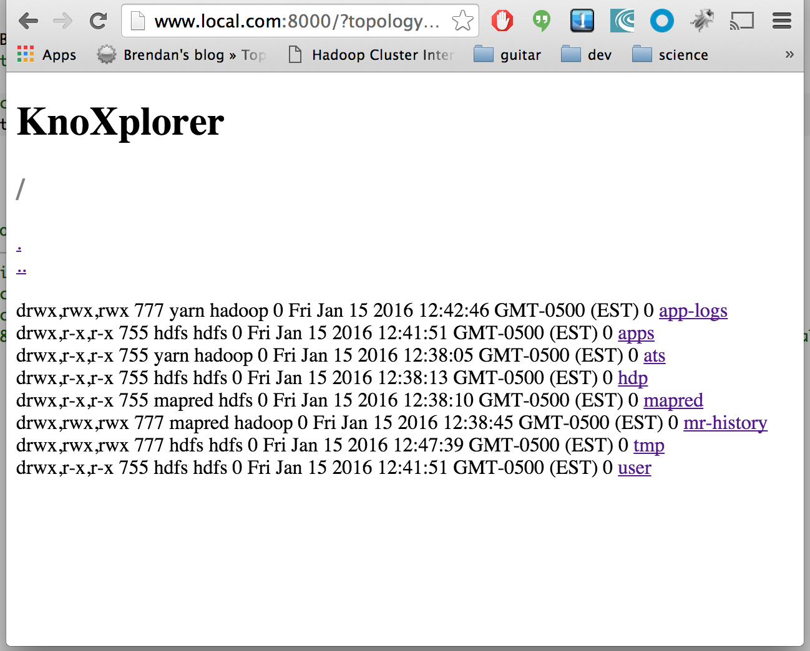

knoxplorer
=======
Browse HDFS through Apache Knox.

A simple demo application that leverages KnoxSSO service and SSOCookie provider to authenticate once and use the SSO cookie for subsequent requests.



Requires python for the SimpleHTTPServer (or you can use another web server).

1. Clone or checkout this project.
2. Execute start.py or deploy the html and js files to your webserver
3. Navigate to http://localhost:8000/?topology=localhost:8443/gateway/sandbox/

Login Details and Link
========
The login link in index.html is pointing to the KnoxSSO topology and indicating that the target URL (originalURL) is this application itself. This is an effective way to leverage the SP initiated authentication through a login link.

https://localhost:8443/gateway/knoxsso/api/v1/websso?originalUrl=http://localhost:8000?topology=localhost:8443/gateway/sandbox&path=/

It also provides a query parameter for the knoxplorer application that indicates the topology to use as the endpoint for Hadoop cluster access and is currently hardcoded to "sandbox".

Note that the hostnames may need to be changed depending on the browser you are using and/or the SSO IdP that you are using. For instance:

1. Chrome does not like localhost for cookies which are required for KnoxSSO and many SSO IdPs
2. Okta does not like 127.0.0.1 for the callback URL

For situations like this I have added a phoney domain to /etc/hosts to represent my local machine: "www.local.com" this has worked for me.

Apache Knox Configuration
========

## KnoxSSO Topology:

In order for the Login Link above to work, we need to have a configured KnoxSSO topology in the Knox Gateway instance that we are point to. Below is an example that leverages an Okta application for SSO:

```
<topology>
    <gateway>
      <provider>
          <role>federation</role>
          <name>pac4j</name>
          <enabled>true</enabled>
          <param>
            <name>pac4j.callbackUrl</name>
            <value>https://www.local.com:8443/gateway/knoxsso/api/v1/websso</value>
          </param>
          <param>
            <name>saml.keystorePassword</name>
            <value>knox</value>
          </param>
          <param>
            <name>saml.privateKeyPassword</name>
            <value>knox</value>
          </param>
          <param>
            <name>saml.keystorePath</name>
            <value>{GATEWAY_HOME}/knox-0.8.0-SNAPSHOT/data/security/keystores/gateway.jks</value>
          </param>
          <param>
            <name>saml.identityProviderMetadataPath</name>
            <value>https://dev-122415.oktapreview.com/app/exk5nc5z1xbFKb7nH0h7/sso/saml/metadata</value>
          </param>
          <param>
            <name>saml.serviceProviderMetadataPath</name>
            <value>sp-metadata.xml</value>
          </param>
          <param>
            <name>saml.serviceProviderEntityId</name>
            <value>https://www.local.com:8443/gateway/knoxsso/api/v1/websso?pac4jCallback=true&amp;client_name=SAML2Client</value>
          </param>
      </provider>
      <provider>
          <role>identity-assertion</role>
          <name>Default</name>
          <enabled>true</enabled>
          <param>
            <name>principal.mapping</name>
            <value>guest@example.com=guest;</value>
          </param>
      </provider>
    </gateway>
    <service>
        <role>KNOXSSO</role>
        <param>
          <name>knoxsso.cookie.secure.only</name>
          <value>true</value>
       </param>
       <param>
         <name>knoxsso.token.ttl</name>
         <value>100000</value>
       </param>
       <param>
          <name>knoxsso.redirect.whitelist.regex</name>
          <value>^https?:\/\/(www\.local\.com|localhost|127\.0\.0\.1|0:0:0:0:0:0:0:1|::1):[0-9].*$</value>
       </param>
    </service>
</topology>
```

This particular KnoxSSO deployment is using the pac4j provider to authenticate via Okta as a SAML IdP. The same type of SAML integration can be done with other providers such as Shibboleth, Keystone, etc. See the pac4j provider documentation for details of other supported providers: http://knox.apache.org/books/knox-0-8-0/user-guide.html#Pac4j+Provider+-+CAS+/+OAuth+/+SAML+/+OpenID+Connect - some examples are OpenId Connect, CAS Server, Twitter, Facebook, etc.

You will also notice the KNOXSSO service declaration. Given a successful login by the pac4j provider, the KNOXSSO service will create an SSO cookie that can be used as the proof of authentication to the originalUrl until the cookie or the token within the cookie expires. Docs can be found http://knox.apache.org/books/knox-0-8-0/user-guide.html#KnoxSSO+Setup+and+Configuration - for the KnoxSSO service.

What may be less clear is that this simple application doesn't actually care about the user identity but the REST API calls to WebHDFS within the knox.js file of this application must provide the SSO cookie on each call. The cookie is verified by the Apache Knox Gateway for each call to ensure that it is trusted, not expired and extracts the identity information for interaction with the Hadoop WebHDFS service.

Please also note the knoxsso.redirect.whitelist.regex parameter in the KNOXSSO service. This semicolon separated list of regex expressions (there is only one in this case) will be used to validate the originalUrl query parameter to ensure that KnoxSSO will only redirect browsers to trusted sites. This is to avoid things like phishing attacks.

Finally, within the identity-assertion provider, we need to map the IdP identity principal to a username that will be acceptable within the Hadoop cluster. In many cases the authenticated principal will be a numeric id or guid. This will need to be mapped to an actual username. In some cases, such as this particular Okta application, you may configure the id representation that the IdP should provide to SPs. I told it to return the users' email address as the Id and I map that to "guest".

We need to identify and build an enterprise principal mapping or lookup facility that would be much more scalable and manageable than mapping every username within the topology file but in the meantime this will do.

## Sandbox Topology:
The topology that defines the endpoint used to actually access Hadoop resources through the Apache Gateway in this deployment is called sandbox.xml. The following configuration assumes the use of the Hortonworks sandbox VM based Hadoop cluster to enable quick deployment and getting started with Hadoop and app development.

In order to leverage the single sign on capabilities described earlier, this topology much configure the SSOCookie federation provider. This essentially means that the SSO cookie is required in order to access any of the Hadoop endpoints configured within this topology.

```
<topology>
    <gateway>
      <provider>
          <role>webappsec</role>
          <name>WebAppSec</name>
          <enabled>true</enabled>
          <param>
            <name>cors.enabled</name>
            <value>true</value>
          </param>
      </provider>
      <provider>
          <role>federation</role>
          <name>SSOCookieProvider</name>
          <enabled>true</enabled>
          <param>
              <name>sso.authentication.provider.url</name>
              <value>https://www.local.com:8443/gateway/knoxsso/api/v1/websso</value>
          </param>
      </provider>
      <provider>
          <role>identity-assertion</role>
          <name>Default</name>
          <enabled>true</enabled>
      </provider>
    </gateway>
    <service>
        <role>NAMENODE</role>
        <url>hdfs://localhost:8020</url>
    </service>
    <service>
        <role>JOBTRACKER</role>
        <url>rpc://localhost:8050</url>
    </service>
    <service>
        <role>WEBHDFS</role>
        <url>http://localhost:50070/webhdfs</url>
    </service>
    <service>
        <role>WEBHCAT</role>
        <url>http://localhost:50111/templeton</url>
    </service>
    <service>
        <role>OOZIE</role>
        <url>http://localhost:11000/oozie</url>
    </service>
    <service>
        <role>WEBHBASE</role>
        <url>http://localhost:60080</url>
    </service>
    <service>
        <role>HIVE</role>
        <url>http://localhost:10001/cliservice</url>
    </service>
    <service>
        <role>RESOURCEMANAGER</role>
        <url>http://localhost:8088/ws</url>
    </service>
</topology>
```

You can see that CORS must be enabled for the browser to allow REST API calls from javascript to an endpoint other than the one used to serve this application and to present the cookie as a credential. Therefore, the WebAppSec provider is configured and setup to enable CORS.

Also note that there is no need to do principal mapping in this topology. That is because we did that in the KnoxSSO topology which results in the identity within the token to be the mapped or effective principal. We could also move that principal mapping to each topology that may want map the same IdP identity to different users. This is left up to the admin.

Troubleshooting
=======

The most likely trouble that you will run into will be related to cookies and domains. Make sure that the domains that you are using for each configured URL are the same and are acceptable to your IdP and browser.

Another issue that might crop up would be the secureOnly flag on the cookie - if you are not running Apache Knox with SSL enabled (shame on you) then this flag must not be set. See the KnoxSSO topology and service for setting that to false.

If authentication seems to be successful but there is no listing rendered. Ensure that there is a principal mapping for the username being asserted to the WebHDFS service. Check the audit log for the username being used and map it to "guest" as necessary.

ENJOY!
====
